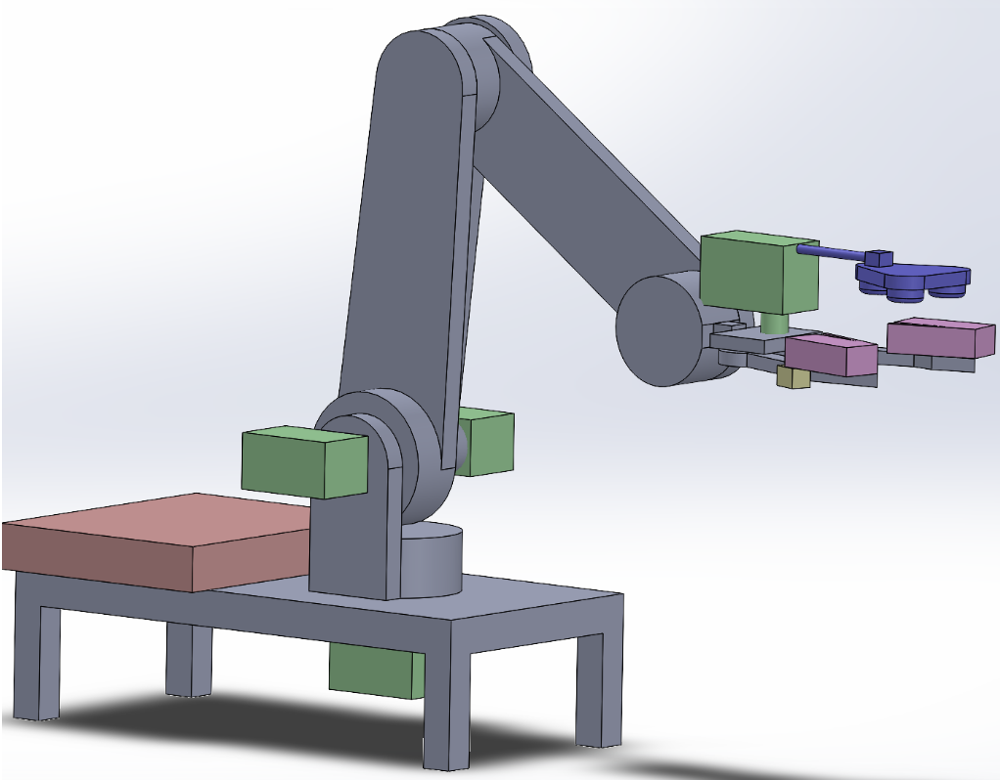
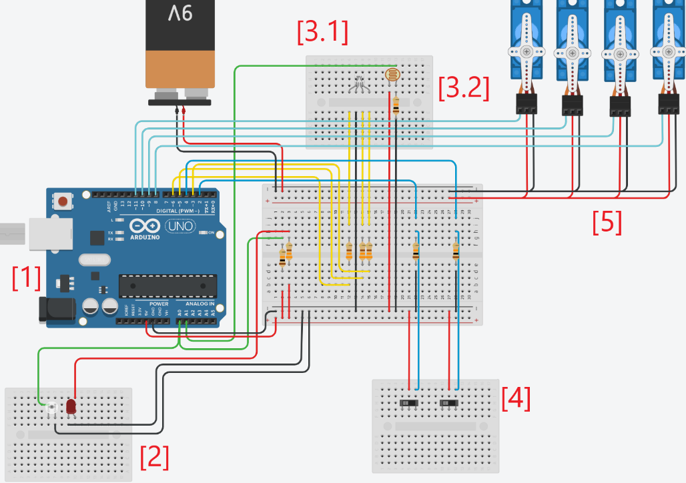
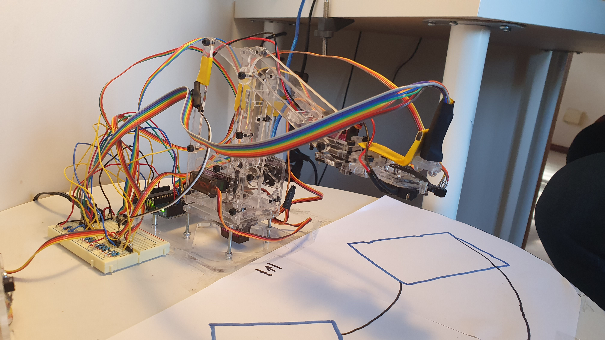

# 4-DoF-Bot
This project involves building a robot arm “manipulator” that can locate and grab the
coloured object from one place to another place within its workspace. The object will need
to be placed in a container with different compartment based on the size of the object.

Working: https://youtu.be/DJXzEvkOSws

# Inital CAD

# Circuit design

The main components are described according to their assigned numbers above: 

[1] – The Arduino Uno

[2] – The Edge Detector:  The edge detector used consists of an Infrared (IR) LED adjacent to a phototransistor. 

[3] – The Colour Sensor: The colour sensor consists of two parts:
3 differently coloured LED’s, modelled as a single RGB LED.

[4] – The Limit Switches.

[5] – The Servos.

# Final Design

